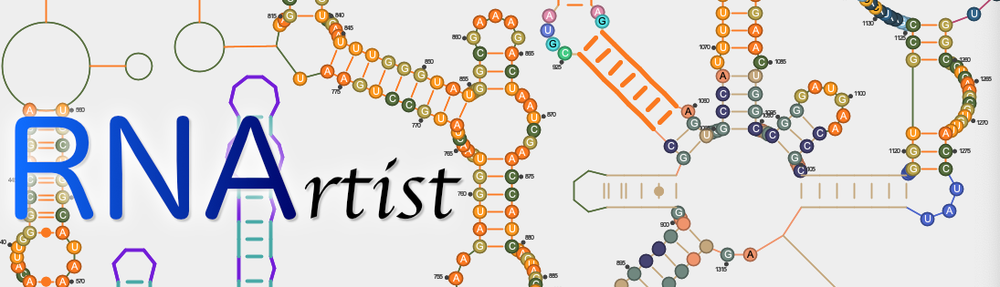

RNArtist allows you to design your RNA 2D structures interactively. To help you to be an RNArtist, this tool provides numerous graphical options to find your theme and to modify the 2D layout.

* [Screen Captures](#captures)
* [Prerequisites](#prerequesites)
* [Installation](#installation)
* [Launch](#launch)

## <a name="captures"></a>Screen captures

* Any part of an RNA 2D can have different design, from single residues to entire branches


* [P4-P6 domain](https://www.rcsb.org/structure/1HR2) in RNArtist linked to UCSF chimera. You can easily apply colors in your 2D to the 3D architecture.


* [tRNA crystal structure](https://www.rcsb.org/structure/1EHZ) in RNArtist linked to UCSF chimera. 


## <a name="prerequesites"></a>Prerequisites

You need the tool [maven](https://maven.apache.org) and a [Java distribution](https://www.oracle.com/java/technologies/javase-downloads.html) to be installed (type the commands ```mvn``` and ```java``` from a command line to check). 

On Linux Systems, you can install maven with the command ``sudo apt get install maven``

RNArtist has been developed with OpenJDK 15. To compile it with OpenJDK 11 (the most recent Long Term Support version available on computers), you just need to change the value of the property java.version in the pom file.

## <a name="installation"></a>Installation

Download the project as [a zip file](https://github.com/fjossinet/RNArtist/archive/master.zip) or with the command git (git clone https://github.com/fjossinet/RNArtist.git).

From the project directory, type: 

```
mvn clean package
```

## <a name="launch"></a>Launch

### Using Maven

From the project directory, type:

```
mvn exec:exec
```

### Using the launch scripts directly

From the subdirectory target/RNArtist, run the file for your operating system by typing: 

```./launch_rnartist_for_...```

You can find more details about this project on my [Twitter Account](https://twitter.com/rnartist_app)
