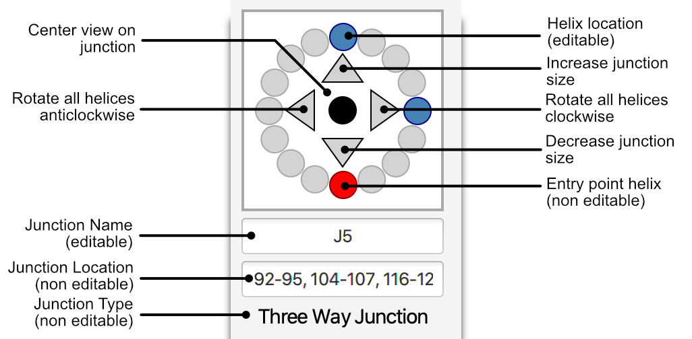

RNArtist
=========

RNArtist allows you to design your RNA 2D structures interactively. To help you to be an RNArtist, this tool provides numerous graphical options to find your theme and to modify the 2D layout.

## Prerequisites
You need the tool maven and a Java distribution to be installed (type the commands ```mvn``` and ```java``` from a command line to check). You need at least Java 11.

## Installation

In the project directory type: 

```
mvn clean package
```

## Run

In the directory target/RNArtist, and run the file for your operating system by typing: 

```./launch_rnartist_for_...```

You can find more details about this project on my [Twitter Account](https://twitter.com/rnartist_app)

## Theme Panel to pimp your RNA2D.


## Layout Panel to reorganize your RNA2D.



## Visualization of the tertiary interactions network.


