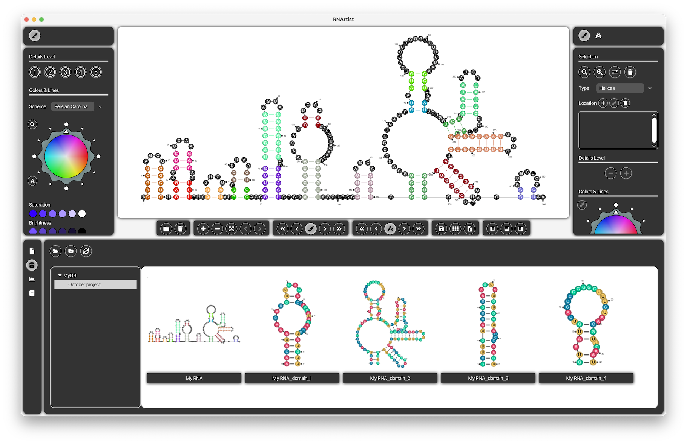
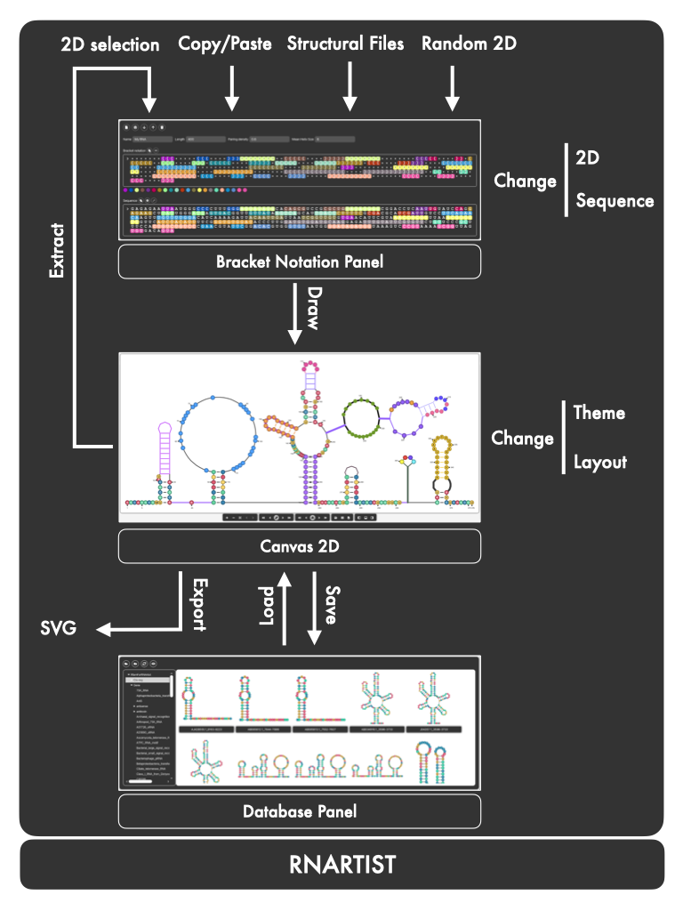
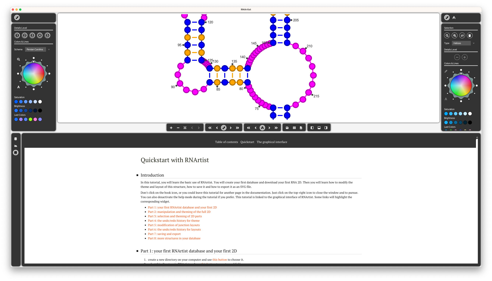

# RNArtist: an interactive tool to construct and manage a collection of RNA 2D structures

# Screenshots

# Workflow

# Main features

* create and edit single RNA structures with the interactive bracket notation panel
* gather RNA 2Ds into collections of RNA structures with the database panel
* fill your collections with RNA secondary structures (a.k.a. RNA 2Ds) described with standard file formats like Vienna, bpseq, ct, stockholm and even pdb
* you can also drag-and-drop structures described in RNA database entries (RNACentral for now) from your browser into your database in RNArtist. Data will be automatically downloaded, stored and plotted.
* the RNA objects making the RNA 2Ds constructed with RNArtist integrates the last structural features from the field (Leontis-Westhof classification, classes of junctions (apical loops, inner loops, 3-Way, 4-way junctions,...), tertiary interactions)
* RNArtist contains a built-in algorithm to produce a first draft of an RNA 2D based on a non-overlapping display
* the layout (size and helices orientations) for any junction can be modified interactively afterwards
* the display from a full 2D to single residues can be modified to fit your needs. RNArtist provides graphical widgets to choose the color and the line width (more options will be available soon)
* each RNA object inside an RNA 2D can be lowly or highly rendered. This allows to simplify the display for entire domains in order to highlight important ones 
* you can easily undo/redo your modifications. RNArtist manages two different undo/redo histories: one for the theme and another one for the layout
* the theme and the layout designed for a single 2D can be applied on an entire project or RNA family
* the selection of RNA objects can be done graphically (mouse clicks) or automatically (search panel). Successive mouse clicks on the same residue allows to easily select its parents (for example residue -> secondary interaction -> helix -> branch containing this helix). Consequently, you can select entire branches of large RNAs in few clicks
* the work done on an RNA 2D is saved as a script based on the DSL syntax from [RNArtistCore](https://github.com/fjossinet/RNArtistCore). Consequently, the scripts produced with RNArtist are fully compatible with the command-line tool available with RNArtistCore. RNArtist can be seen as a graphical front-end for the design of RNArtistCore scripts
* the drawings can be exported into an SVG file compatible with tools like Affinity Designer, Inkscape or Adobe Illustrator
* a documentation and an interactive tutorial are available from within RNArtist (meaning up-to-date and linked to the graphical interface to better guide you)

# Installation and launch

RNArtist can be easily installed on MacOS, Linux and Windows thanks to the [jdeploy](https://www.jdeploy.com). Download the installer for your computer [at this address](https://www.jdeploy.com/~rnartist). These installers provide automatic updates. RNArtist downloads updates automatically at launch time so that you are always up-to-date.

For a summary of what's new for the different releases, you can check [this page](Changelog.md)

# Quickstart and embedded documentation

After its launch, RNArtist shows you the documentation page to quickstart. It is an interactive tutorial to learn the basic use of RNArtist. You will create your first database and download
your first RNA 2D. Then you will learn how to modify the theme and layout of this structure, how to save it and how to export it as an SVG file. 

You just need an empty folder to start with this tutorial. And there is no need to start each time from the beginning. The tutorial provides links to launch scripts that will produce a fresh start for any step you're interested in.

You can also freely browse the documentation (choose "Table of Contents" at the top of the Quickstart page). The documentation is also interactive, with the ability to highlight the graphical widget detailed.

# Upcoming features

* link with ChimeraX for RNA 2Ds derived from pdb files
* the ability to link experimental data to your RNA 2Ds (like quantitative values from high throughput RNA structure determination). This will allow you to produce a display for your 2D according to the values linked to its residues
* the ability to produce animations
* the ability to annotate your structure
* more theme options (shape of a residue: circle, square, polygons,...)
* a widget to construct and preview your own theme for the full 2D before to apply it
* more interactive tutorials
* databases browsable directly from RNArtist. Rfam is quite almost ready to be released.

## Disclaimer

RNArtist is still under active development. Some features are subject to change. 
